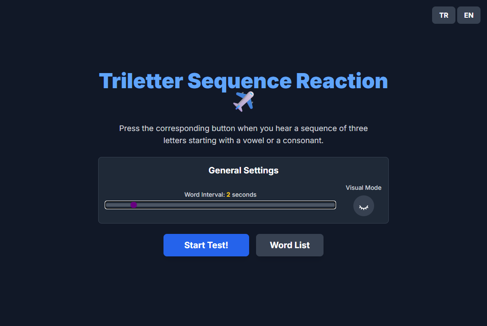
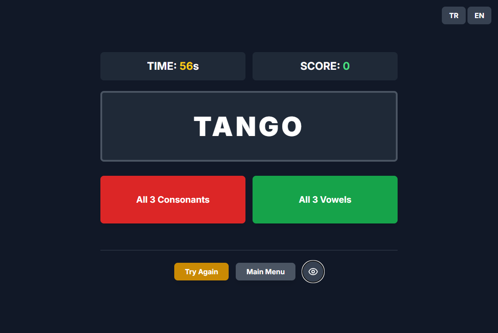
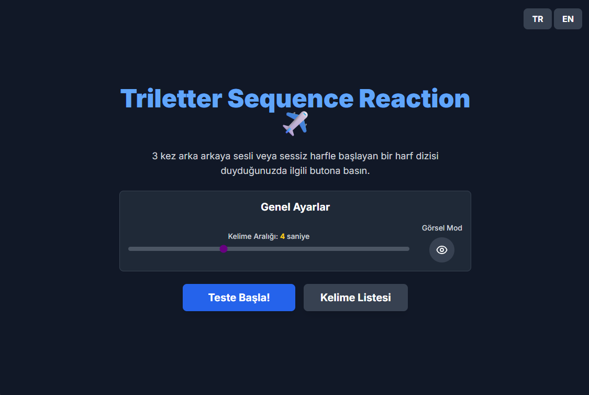
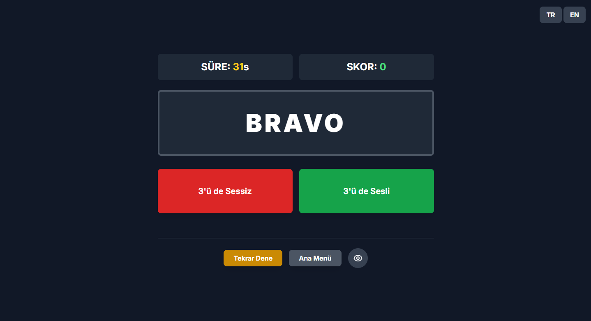

# Triletter Sequence Reaction

# [Click here to try the app!](https://metonya.github.io/triletter-sequence-reaction/)

This project is a web-based psychomotor and multitasking capacity test designed for pilot candidates. The test presents a series of letters, and the user must react when a sequence of three consecutive letters starting with a vowel or a consonant occurs.

## How it works

The application reads a list of words and presents them to the user at a certain interval. The user's task is to identify a sequence of three consecutive words that start with a vowel or a consonant and press the corresponding button. The test measures the user's attention, reaction time, and multitasking ability.

## Features

- Customizable word list (JSON format)
- Adjustable word interval
- Visual and auditory stimuli
- Language selection (English and Turkish)

## Screenshots

**Main Menu**

**In-Game**

---

# Triletter Sequence Reaction (Türkçe)

# [Uygulamayı denemek için buraya tıklayın!](https://metonya.github.io/triletter-sequence-reaction/)

Bu proje, pilot adayları için tasarlanmış web tabanlı bir psikomotor ve çoklu görev kapasitesi testidir. Test, bir dizi harf sunar ve kullanıcı, sesli veya sessiz harfle başlayan art arda üç harflik bir dizi oluştuğunda tepki vermelidir.

## Nasıl Çalışır?

Uygulama, bir kelime listesini okur ve bunları kullanıcıya belirli bir aralıkta sunar. Kullanıcının görevi, sesli veya sessiz harfle başlayan art arda üç kelimelik bir diziyi belirlemek ve ilgili düğmeye basmaktır. Test, kullanıcının dikkatini, tepki süresini ve çoklu görev yeteneğini ölçer.

## Özellikler

- Özelleştirilebilir kelime listesi (JSON formatında)
- Ayarlanabilir kelime aralığı
- Görsel ve işitsel uyaranlar
- Dil seçimi (İngilizce ve Türkçe)

## Ekran Görüntüleri

**Ana Menü**

**Oyun İçi**

